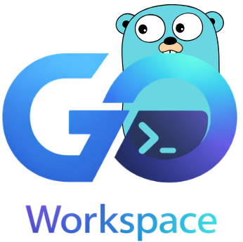

    

## 🧭 Guia de Navegação

- [📖 Descrição](#descricao)
- [🛠️ Build & Execução](#build-execucao)
- [🏢 Projetos](#projetos)
- [🗺️ Diagramas](#diagramas)
- [👤 Sobre o Desenvolvedor](#sobre-o-desenvolvedor)
- [📜 Licença](#licenca)

---

## 📖 Descrição 

O repositório **go-workspace** é um ambiente completo para estudos, prototipagem e desenvolvimento de APIs, exemplos didáticos e projetos reais em Go, com integração a Bazel, Docker/Podman e PostgreSQL.

---

## 🛠️ Build & Execução 

| Comando       | Descrição rápida                  |
| ------------- | --------------------------------- |
| `make build`  | Compila a aplicação               |
| `make dev`    | Hot reload API (Air + Bazel + DB) |
| `make prod`   | Modo interativo (menu)            |
| `make db-up`  | Inicia o banco PostgreSQL         |
| `make api-up` | Sobe containers da stack          |
| ...           | Outros comandos na documentação   |

🔗 [Documentação completa](docs/guides/build-execution.md)

---

## 🏢 Projetos 

| Projeto         | Descrição rápida                      | Stack/Porta   |
| --------------- | ------------------------------------- | ------------- |
| 01_products_api | API REST, JWT, PostgreSQL, containers | docker/podman |
| ping-api        | Serviço ping HTTP simples             | 8080          |

🔗 [Documentação completa](docs/guides/projects.md)

## 🗺️ Diagramas 

Todos os diagramas visuais e fluxos de arquitetura estão centralizados em:

👉 [docs/guides/architecture-visuals.md](docs/guides/architecture-visuals.md)

Esse documento contém:

- Arquitetura Geral (Mermaid)
- Fluxo de Sequência (Mermaid)
- Diagramas e guias visuais futuros

---

## 👤 Sobre o Desenvolvedor 

<table align="center">
  <tr>
    <td align="center">
         
        
        

        <a href="https://github.com/0nF1REy" target="_blank">
          <strong>Alan Ryan</strong>
        </a>
        

        ☕ Peopleware | Tech Enthusiast | Code Slinger ☕
         
        Apaixonado por código limpo, arquitetura escalável e experiências digitais envolventes
        

          Conecte-se comigo:
        

        
        
        
        

    </td>
  </tr>
</table>

---

## 📜 Licença 

Este projeto está sob a **licença MIT**. Consulte o arquivo **[LICENSE](LICENSE)** para obter mais detalhes.

> ℹ️ **Aviso de Licença:** &copy; 2026 Alan Ryan da Silva Domingues. Este projeto está licenciado sob os termos da licença MIT. Isso significa que você pode usá-lo, copiá-lo, modificá-lo e distribuí-lo com liberdade, desde que mantenha os avisos de copyright.

⭐ Se este repositório foi útil para você, considere dar uma estrela!
