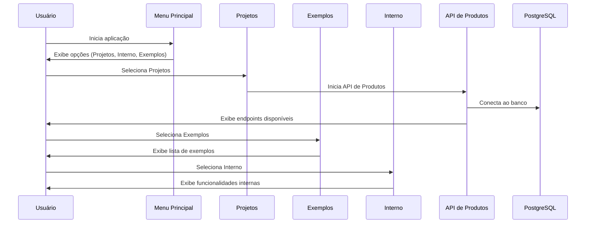

# 🗺️ Diagramas de Arquitetura

[🔙 Voltar para o README principal](../../README.md)

Este documento centraliza todos os diagramas visuais do projeto go-workspace, incluindo arquitetura geral e fluxos de sequência.

## Arquitetura Geral

```mermaid
graph TD
    A[Usuário] --> B[Menu Principal]
    B --> C[Projetos]
    B --> D[Interno]
    B --> E[Exemplos]
    C --> F[API de Produtos]
    E --> G[Exemplo Hello World]
    E --> H[Exemplo Ponteiro]
    E --> I[Exemplo Album Info]
    E --> J[Exemplo Loops]
    E --> K[Exemplo Arrays]
    E --> L[Exemplo Maps]
    E --> M[Exemplo Par/Ímpar]
    E --> N[Exemplo Structs Valor]
    E --> O[Exemplo Structs Ponteiro]
    E --> P[Exemplo Structs Ponteiro e Slice]
    E --> Q[Exemplo Interfaces Básico]
    E --> R[Exemplo Interfaces Polimorfismo]
    E --> S[Exemplo Interfaces Type Assertion]
    E --> T[Exemplo Interfaces Type Switch]
    E --> U[Exemplo Interfaces Empty]
    E --> V[Exemplo User Welcome]
    E --> W[Exemplo Auth]
    E --> X[Exemplo Error]
    E --> Y[Exemplo Funções Variádicas]
    F --> Z[Camadas: Controller, Repository, Usecase, Middleware, DB]
    F --> AA[Rotas: /api/v1/ping, /auth/register]
    F --> AB[Container: PostgreSQL]
    F --> AC[Configuração: .env, docker-compose.yml]
```

## Fluxo de Sequência

