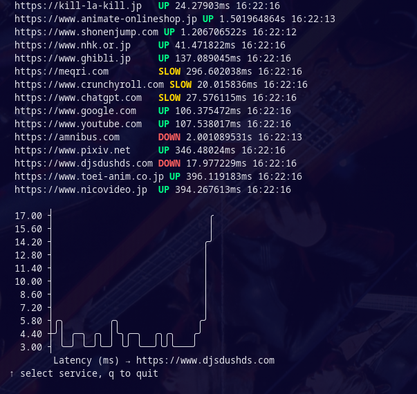

# Health Checker

## 🧭 Guia de Navegação

<a name="guia-navegacao"></a>

- [📖 Descrição](#descricao)
- [📸 Demonstração](#demonstracao)
- [⚙️ Funcionalidades](#funcionalidades)
- [🗂️ Estrutura do Projeto](#estrutura-projeto)
- [🔄 Como Funciona](#como-funciona)
- [📦 Dependências](#dependencias)
- [🚀 Como Executar](#como-executar)
- [🎛️ Controles da Interface](#controles)
- [🏗️ Estruturas Principais](#estruturas-principais)

---

## 📖 Descrição <a name="descricao"></a>

O **Health Checker** é uma aplicação de linha de comando interativa desenvolvida em Go, utilizando a biblioteca [Bubble Tea](https://github.com/charmbracelet/bubbletea) para TUI (Text User Interface). O objetivo do projeto é monitorar periodicamente a saúde (status e latência) de diversos serviços web, exibindo os resultados em tempo real com uma interface amigável e visual.

## 📸 Demonstração <a name="demonstracao"></a>



## ⚙️ Funcionalidades <a name="funcionalidades"></a>

- Verificação periódica de múltiplos serviços (URLs).
- Exibição do status (UP, DOWN, SLOW) e latência de cada serviço.
- Histórico de latência apresentado em gráfico ASCII.
- Interface interativa: navegação entre serviços, atualização automática e encerramento via teclado.

## 🗂️ Estrutura do Projeto <a name="estrutura-projeto"></a>

```
01_health_checker/
├── cmd/
│   └── main.go           # Ponto de entrada da aplicação
├── internal/
│   ├── checker/          # Lógica de verificação dos serviços
│   │   ├── checker.go    # Função para checar status de uma URL
│   │   ├── monitor.go    # Loop de monitoramento periódico
│   │   └── runner.go     # Execução concorrente das checagens
│   ├── model/
│   │   └── result.go     # Estrutura dos resultados das checagens
│   └── tui/              # Interface de usuário (TUI)
│       ├── app.go        # Inicialização da interface
│       ├── model.go      # Modelo de dados da dashboard
│       ├── styles.go     # Estilos visuais (cores, bordas)
│       ├── update.go     # Lógica de atualização de estado
│       └── view.go       # Renderização da interface
└── README.md             # Este arquivo
```

## 🔄 Como Funciona <a name="como-funciona"></a>

1. **Monitoramento**: O sistema possui uma lista fixa de URLs de serviços a serem monitorados.
2. **Checagem**: A cada 5 segundos, todas as URLs são verificadas em paralelo. Para cada serviço, é feita uma requisição HTTP com timeout de 2 segundos.
3. **Resultados**: O status (UP, DOWN, SLOW), latência e horário da última checagem são enviados para a interface.
4. **Interface**: O usuário visualiza uma tabela com os serviços, pode navegar entre eles e ver o histórico de latência em gráfico.

## 📦 Dependências <a name="dependencias"></a>

- [Go](https://golang.org/) >= 1.26.1
- [Bubble Tea](https://github.com/charmbracelet/bubbletea)
- [Lipgloss](https://github.com/charmbracelet/lipgloss)
- [asciigraph](https://github.com/guptarohit/asciigraph)

As dependências são gerenciadas via Bazel e Go Modules.

## 🚀 Como Executar <a name="como-executar"></a>

1. **Via Bazel** (recomendado):

   ```sh
   cd src/services/bubble_tea/01_health_checker
   bazel run //cmd:cmd
   ```

2. **Via Go** (direto):
   ```sh
   cd src/services/bubble_tea/01_health_checker/cmd
   go run main.go
   ```

## 🎛️ Controles da Interface <a name="controles"></a>

- `↑` / `↓` : Navega entre os serviços
- `q` : Sai da aplicação

## 🏗️ Estruturas Principais <a name="estruturas-principais"></a>

### Result (model/result.go)

```go
// Representa o resultado de uma checagem de serviço
Result struct {
	URL     string
	Status  string // UP, DOWN, SLOW
	Latency time.Duration
	Error   string
	Checked time.Time
}
```

### Dashboard (tui/model.go)

```go
// Modelo da dashboard interativa
Dashboard struct {
	results  map[string]model.Result
	history  map[string][]float64
	selected string
	stream   chan model.Result
}
```
