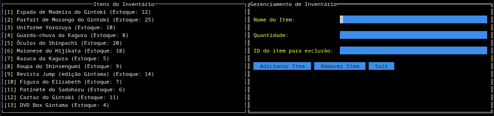
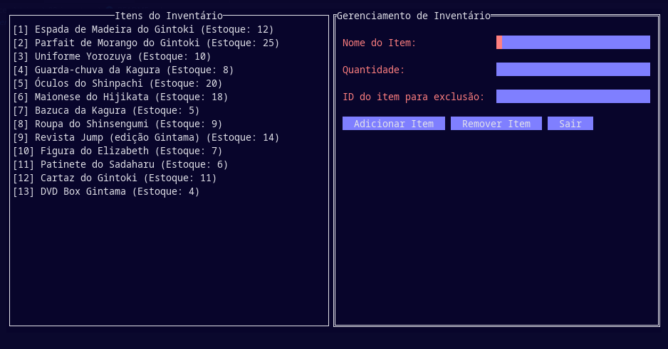

# Gerenciador de Inventário TUI

## 🧭 Guia de Navegação

<a name="guia-navegacao"></a>

- [📖 Descrição](#descricao)
- [📸 Demonstração](#demonstracao)
- [🛠️ Funcionalidades](#funcionalidades)
- [📦 Pré-requisitos](#pre-requisitos)
- [🖥️ Como Usar](#como-usar)
- [📄 Estrutura dos Dados](#estrutura-dos-dados)
- [🧩 Estrutura do Código](#estrutura-do-codigo)

---

## 📖 Descrição <a name="descricao"></a>

Este projeto é um aplicativo de gerenciamento de inventário em modo texto (TUI), desenvolvido em Go, utilizando a biblioteca [tview](https://github.com/rivo/tview). Ele permite adicionar, visualizar e remover itens do estoque de maneira prática, com persistência dos dados em um arquivo JSON (`inventory.json`).

## 📸 Demonstração <a name="demonstracao"></a>




## 🛠️ Funcionalidades <a name="funcionalidades"></a>

- **Adicionar Itens**: Insira o nome e a quantidade para cadastrar novos produtos no inventário.
- **Visualizar Inventário**: Veja a lista completa dos itens cadastrados e suas quantidades.
- **Remover Itens**: Exclua itens do inventário informando o ID correspondente.
- **Persistência**: Todos os dados são salvos automaticamente em `inventory.json` e carregados ao iniciar o aplicativo.

## 📦 Pré-requisitos <a name="pre-requisitos"></a>

- **Go 1.26.1** ou superior
- Biblioteca `tview`

## 🖥️ Como Usar <a name="como-usar"></a>

### Adicionar um Item

1. Preencha o campo **Nome do Item**.
2. Preencha o campo **Quantidade**.
3. Clique em **Adicionar Item** para salvar.

### Remover um Item

1. Informe o **ID do item para exclusão** (o número exibido à esquerda do item na lista).
2. Clique em **Remover Item**.

### Sair do Aplicativo

- Clique em **Sair** para fechar a aplicação.

## 📄 Estrutura dos Dados <a name="estrutura-dos-dados"></a>

Os itens do inventário são armazenados em um arquivo `inventory.json` no seguinte formato:

```json
[
  {
    "name": "Nome do Produto",
    "stock": 10
  }
]
```

## 🧩 Estrutura do Código <a name="estrutura-do-codigo"></a>

- `main.go`: Implementa toda a lógica da interface TUI, manipulação do inventário e persistência dos dados.
  - `loadInventory()`: Carrega os dados do inventário do arquivo JSON.
  - `saveInventory()`: Salva o inventário atual no arquivo JSON.
  - `deleteItem(index int)`: Remove um item do inventário pelo índice.
